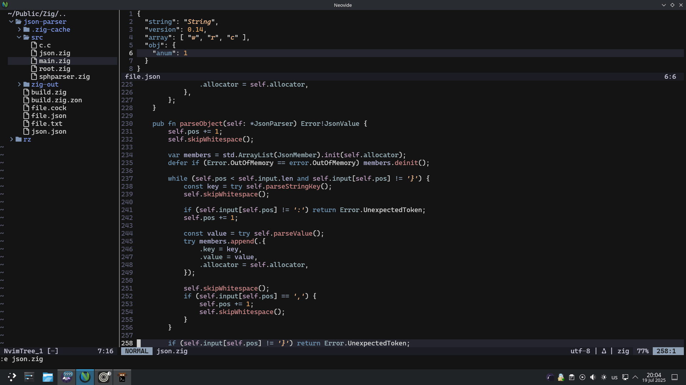

> This is a neovide btw

### Package manager
[packer.nvim](https://github.com/wbthomason/packer.nvim)

### Plugins count
13

### Must have plugins
 - [nvim-tree](github.com/nvim-tree/nvim-tree.lua)
 - [nvim-treesitter](github.com/nvim-treesitter/nvim-treesitter)
 - [toggleterm.nvim](github.com/akinsho/toggleterm.nvim)
 - [lualine.nvim](github.com/nvim-lualine/lualine.nvim)

### Keymaps
 - Alt+w - copy to system buffer
 - Ctrl+y - paste from system buffer
 - Ctrl+i - toggle float term
 - Ctrl+Mouse wheel - change scale

### Default cmd settings ([config file](./lua/core/keymaps.lua))
 - noswapfile
 - termguicolors
 - autochdir
 - colorscheme [vscode](github.com/Mofiqul/vscode.nvim)
 - number
